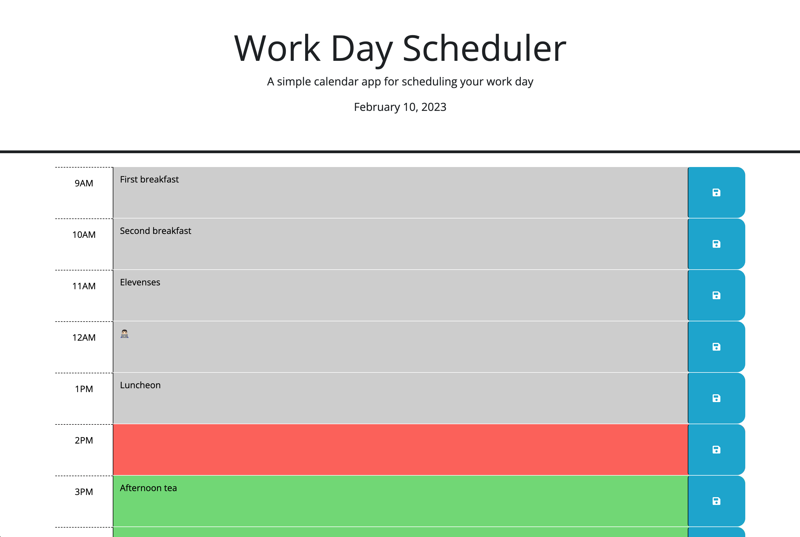

# Work Day Scheduler

## Description

This is a workday scheduler that can be used to plan out your day. Simply open the app, type your entry into the text fields and click the corresponding save button to save that entry. Hours that have passed will be colored grey, current hour is red, and hours that are coming up are colored green. And don't worry about closing the app, the info is saved so the next time you launch it'll be there waiting for you.

This app was created using jQuery, Day.js, and Bootstrap.

The live site can be viewed [here](https://llourn.github.io/work-day-scheduler/).

## Table of Contents

- [Installation](#installation)
- [Credits](#credits)
- [License](#license)

## Installation

Simply clone the repo and open the `index.html` file in your browser.

## Credits

The starting code was provided by UNB Coding Boot Camp: https://bootcamps.unb.ca/

## License

MIT License Copyright (c) 2023 Lorne Cyr

## Badges

